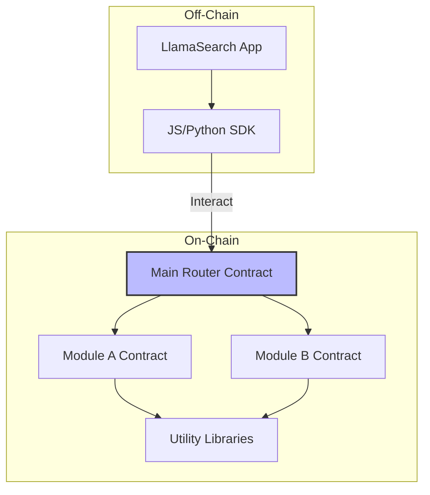

# LlamaSage Contracts 📜

[](https://opensource.org/licenses/MIT)
[](https://soliditylang.org/)
<!-- Add relevant badges: build status, test coverage, gas report -->

## Overview

`LlamaSage Contracts` provides a suite of secure, audited, and gas-efficient smart contracts designed for integration within the LlamaSearch AI ecosystem. These contracts enable decentralized functionalities related to AI model interactions, data verification, or other on-chain logic required by LlamaSearch applications.

This repository contains the core Solidity contracts, deployment scripts, and comprehensive tests.

## Features ✨

*   **Solidity Smart Contracts**: Well-documented and tested contracts (`contracts/`).
*   **Hardhat/Foundry Integration**: Standard development environment setup.
*   **Deployment Scripts**: Easy-to-use scripts for deploying to various networks (`scripts/`).
*   **Comprehensive Testing**: Unit and integration tests using Chai/Waffle/Foundry (`test/`).
*   **Security Focused**: Contracts developed with security best practices in mind.
*   **(Optional) Upgradeability**: Potential use of OpenZeppelin UUPS or Transparent proxies.

## Architecture Concept 🏛️

*(Illustrate the interaction between contracts or key components)*


*Diagram showing an off-chain application interacting via an SDK with a main router contract, which delegates calls to specific module contracts.*

## Prerequisites 🛠️

*   Node.js (v16+ recommended)
*   Yarn or npm
*   Git

## Installation & Setup 💻

1.  **Clone the repository:**
    ```bash
    git clone https://llamasearch.ai # Update URL
    cd llamasage-contracts
    ```

2.  **Install dependencies:**
    ```bash
    yarn install
    # or
    # npm install
    ```

3.  **Compile contracts:**
    ```bash
    yarn compile
    # or
    # npx hardhat compile
    # or
    # forge build (if using Foundry)
    ```

4.  **Environment Variables:**
    *   Create a `.env` file from `.env.example`.
    *   Add necessary API keys (e.g., Etherscan, Infura/Alchemy) and private keys for deployment (use securely!).
    ```bash
    cp .env.example .env
    # Fill in your details in .env
    ```
    *Ensure `.env` is added to your `.gitignore`!*

## Testing 🧪

Run the comprehensive test suite:

```bash
yarn test
# or
# npx hardhat test
# or
# forge test (if using Foundry)
```

Check test coverage:

```bash
yarn coverage
# or
# npx hardhat coverage
```

## Deployment 🚀

Deploy contracts to a specific network (e.g., Sepolia testnet):

```bash
yarn deploy:sepolia
# or
# npx hardhat run scripts/deploy.ts --network sepolia
# or
# forge script script/Deploy.s.sol --rpc-url $SEPOLIA_RPC_URL --broadcast --verify -vvvv (if using Foundry)
```

*(Ensure deployment scripts and network configurations in `hardhat.config.js` or `foundry.toml` are correctly set up)*

## Documentation 📚

*   **Contract Documentation**: Generated documentation (e.g., NatSpec) can be found in `docs/` or viewed inline.
*   **Deployment Info**: Check `deployments/` directory for contract addresses after deployment.

## Contributing 🤝

Contributions are highly valued. Please follow the guidelines in [CONTRIBUTING.md](CONTRIBUTING.md), ensuring secure coding practices and thorough testing.

## License 📄

This project is licensed under the MIT License - see the [LICENSE](LICENSE) file for details.

## Security 🔒

Please refer to [SECURITY.md](SECURITY.md) for details on reporting vulnerabilities and our security practices.

## Support & Community 💬

*   **Issues**: [GitHub Issues](https://llamasearch.ai *(Update link)*
*   **Discord**: [Community Discord](https://discord.gg/llamasearch) *(Update link)*

---

*Smart Contracts powering the LlamaSearchAI Ecosystem.*

# Updated in commit 1 - 2025-04-04 17:36:07

# Updated in commit 9 - 2025-04-04 17:36:07

# Updated in commit 17 - 2025-04-04 17:36:07

# Updated in commit 25 - 2025-04-04 17:36:08

# Updated in commit 1 - 2025-04-05 14:38:07

# Updated in commit 9 - 2025-04-05 14:38:07

# Updated in commit 17 - 2025-04-05 14:38:07

# Updated in commit 25 - 2025-04-05 14:38:07

# Updated in commit 1 - 2025-04-05 15:24:34

# Updated in commit 9 - 2025-04-05 15:24:34

# Updated in commit 17 - 2025-04-05 15:24:34

# Updated in commit 25 - 2025-04-05 15:24:34

# Updated in commit 1 - 2025-04-05 16:00:16
